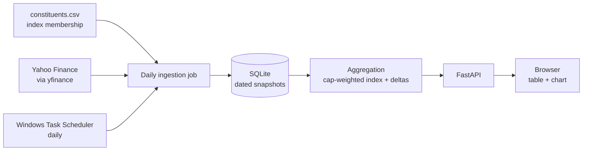

# NASDAQ-100 Analyst Consensus vs the Index

A small, local, free-to-run system that tracks the latest analyst consensus for every
NASDAQ-100 company and compares each company's consensus against the index as a whole.
It refreshes itself once a day, records when each company's consensus last changed, and
serves the result as a web page.

## What it measures

For each stock, the **consensus** is expressed as the analysts' *implied 12-month upside*:

```
implied_upside = (mean analyst price target - current price) / current price
```

The **index** figure is the market-cap-weighted average of that same number across the
constituents, and each company's headline number is its **delta** — how far its own
implied upside sits above or below the index's.

## How it works



The daily job fetches price, price target, and market cap for each constituent, compares
each analyst target to the last stored value, stamps `target_last_changed` when it moves,
and writes a dated snapshot. The web layer reads the latest snapshots, computes the
index number and every stock's delta on demand, and renders them.

## Tech stack

- **Python 3.11+** — the whole application.
- **yfinance** — free analyst data from Yahoo Finance (primary source, behind a swappable
  interface).
- **SQLite** (built-in `sqlite3`) — single-file storage of dated snapshots.
- **FastAPI + uvicorn** — the local web server and data endpoints.
- **Chart.js** — the bar chart on the page.
- **pytest** — tests for the aggregation math.
- **PowerShell + Windows Task Scheduler** — the unattended daily run.

## Project structure

```
Project1/
  config/settings.toml        # locked project decisions
  data/
    constituents.csv          # NASDAQ-100 membership (version-controlled reference data)
    consensus.db              # generated snapshot database (git-ignored)
  logs/                       # run logs (git-ignored)
  scripts/run_ingest.ps1      # PowerShell wrapper for the scheduled job
  src/
    models.py                 # the Quote data structure + the upside formula
    constituents.py           # loads the membership list
    data_sources/
      base.py                 # the DataSource interface
      yahoo.py                # the Yahoo implementation (retries, graceful failure)
    database.py               # schema + save/load
    ingest.py                 # the daily change-detection job
    aggregation.py            # cap-weighted index + per-stock deltas
    api.py                    # FastAPI app
  tests/test_aggregation.py   # aggregation math tests
  web/index.html              # the web page
  requirements.txt
```

## Setup and use

```
python -m venv .venv
.venv\Scripts\activate
pip install -r requirements.txt
```

Populate data (takes a few minutes; polite pause between stocks):

```
python -m src.ingest
```

Serve the site:

```
uvicorn src.api:app --reload
```

Then open <http://127.0.0.1:8000/>. Run the tests with `python -m pytest -q`.

The daily refresh is handled by Windows Task Scheduler via `scripts/run_ingest.ps1`
(see the Phase 7 notes). It uses `-StartWhenAvailable`, so a missed run (machine asleep)
executes when the computer is next available.

## Documented assumptions and limitations

These are deliberate choices, noted so the results are interpreted correctly:

- **12-month horizon.** Analyst price targets are 12-month figures, so the implied upside
  is a yearly expectation, not quarterly. The same horizon applies to both the stock and
  the index number, so the comparison is consistent.
- **Market-cap weighting is an approximation.** The real NASDAQ-100 uses a *modified*
  capitalization weighting with caps on the largest members. This project uses plain
  market-cap weights — close, and free to compute, but not identical to the official index.
- **Dual-class dedup.** Alphabet lists as both `GOOG` and `GOOGL`, and the data source
  reports the *full company* market cap under each. To avoid counting Alphabet twice, the
  secondary listing (`GOOG`) is excluded from the index aggregate.
- **Mega-cap self-weighting.** A few members (Apple, Microsoft, Nvidia) are very large
  parts of the index they are compared against, which dampens their delta versus the index.
  This is inherent to comparing a constituent to its own benchmark.
- **"Changed" means the prediction, not the price.** Prices move every day on their own;
  the analyst target moves only when an analyst revises. `target_last_changed` tracks the
  target, which is what "the consensus changed" means.
- **Missing coverage is excluded.** A stock with no usable price target contributes nothing
  to the index average rather than being counted as zero.
- **Free, unofficial data source.** Yahoo Finance (via yfinance) is not a licensed feed and
  can change format or throttle without notice. The `DataSource` interface exists so a
  fallback provider can be added without touching the rest of the system; fetches already
  retry and degrade gracefully (last-known values persist on failure).
- **Local, personal use.** The data is fetched for a local, non-redistributed, personal
  project. Republishing the data or running this as a public service would raise
  terms-of-service considerations that this scope avoids.

## Maintenance

The constituents list changes only a few times a year (at the index's annual
reconstitution). When it does, update `data/constituents.csv` by hand — a deliberate
choice over a fragile live scrape, since reliability matters more than automation for
data that changes so rarely.
```
